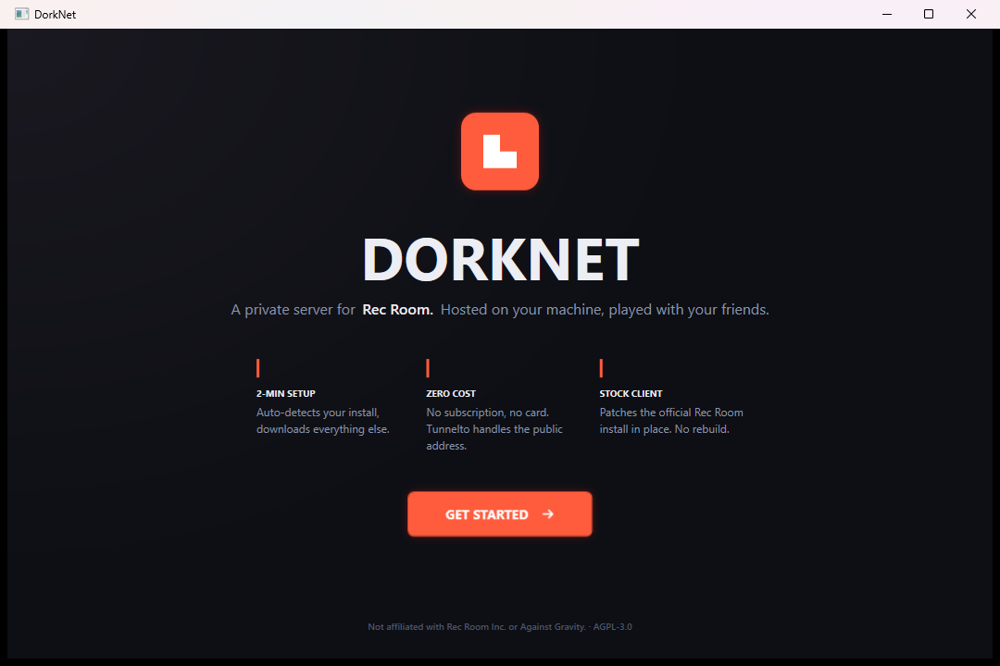
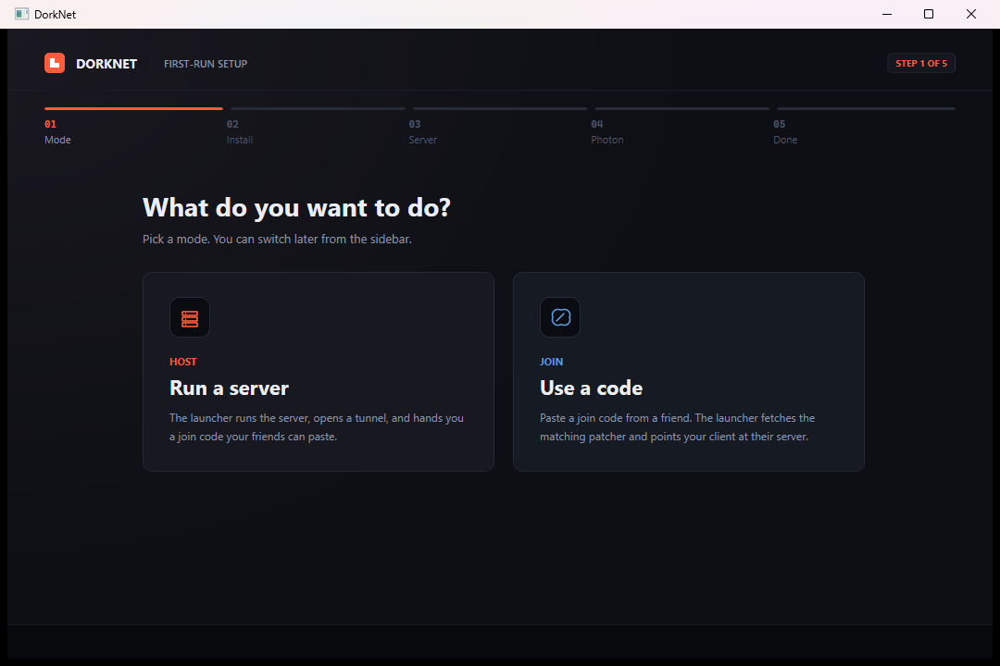
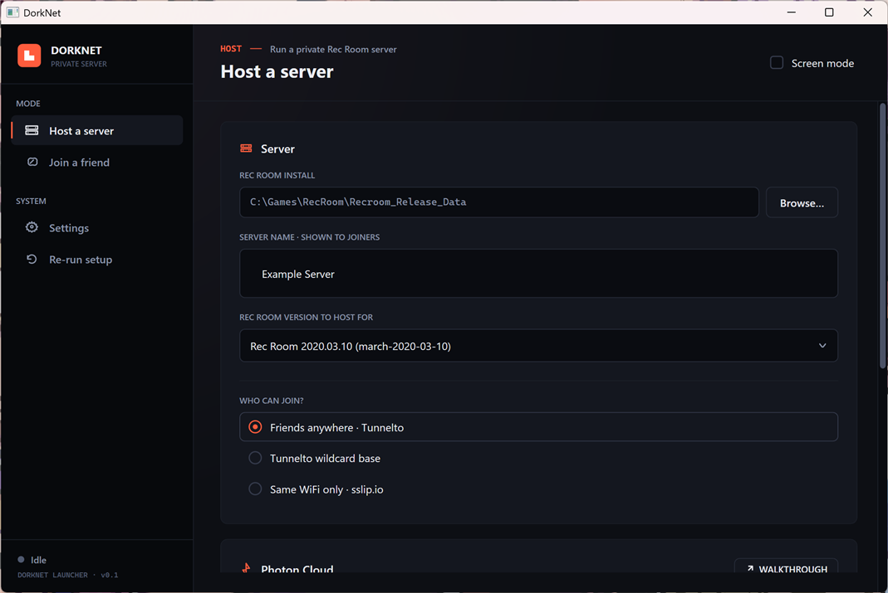

# Easy mode — host your own server

> Built for non-technical hosts. If you can install Discord, you can do this.
>
> **On Linux or macOS?** This guide is for the Windows GUI launcher.
> For headless hosting from a Linux box / a Mac / a VPS, see
> [server-cli.md](server-cli.md). Joiners on those platforms are not
> supported yet — Rec Room itself is a Windows game.

DorkNet bundles everything you need to run a private Rec Room server on
your own machine and hand a join code to your friends. The launcher is a
single Windows app that:

- runs the server,
- opens a Localtunnel HTTPS URL (or, in LAN mode, publishes your local
  address) so friends can connect,
- patches your local copy of Rec Room to point at the server,
- packages a join code your friends paste into their launcher.

## What you'll need

- Windows 10 or 11 (Mac and Linux support are not planned)
- A copy of **Rec Room 2020.03.10** — the specific old build DorkNet
  targets. You acquire this yourself; see
  [Getting the 2020 client](#getting-the-2020-client) below.
- A free Photon Cloud account — the launcher walks you through this on
  first run.
- No account needed for the default "friends anywhere" hosting mode —
  the launcher uses [Localtunnel](https://localtunnel.github.io/www/)
  to get a free, anonymous `*.loca.lt` URL for your server. Auto-fetched
  by the launcher on first run; no sign-in.
- ~5 GB free disk space
- About 10 minutes for first-run setup, ~30 seconds per subsequent launch

## Download

Two flavours on the
[latest release](https://github.com/DorkSquadRR/DorkNet/releases/latest):

- **`dorknet-setup-<version>.exe`** *(recommended)* — installer.
  Drops the launcher under `%LocalAppData%\Programs\DorkNet`, adds
  Start menu + (optional) desktop shortcut, sets up the auto-updater,
  registers an uninstaller. No admin rights required.
- **`dorknet.exe`** — single-file portable. Drop it anywhere; state
  lives in `%APPDATA%\DorkNet`. No shortcuts, no auto-updates.

Either works the same once it's running. Pick the installer if you'd
like Start-menu integration and rolling updates; pick the portable exe
if you'd rather no system changes.

> Windows SmartScreen may warn you on first launch because the binary
> isn't EV-signed. Click "More info" → "Run anyway".

### Auto-updates

The installed launcher checks GitHub on every launch for a newer
release. If one's available, a small banner appears in the sidebar
with an **Install &amp; restart** button. Click it; the launcher
downloads the new binary, shuts itself down, swaps the exe in place,
and relaunches.

Turn this off during setup by un-ticking *Check for updates on launch*,
or any time later by editing `HKCU\Software\DorkNet\AutoUpdate` (0
disables). The portable `dorknet.exe` doesn't auto-update — pull a new
release yourself when you want one.

## First launch — the welcome screen

The very first time you open DorkNet you get a hero screen.

Click **GET STARTED** to enter the setup wizard. The wizard only runs
once; future launches drop you straight into the main view.

## The setup wizard

Five steps, top stepper shows your progress. **Back** and **Next** sit
in the bottom bar; the choice cards on the first step auto-advance when
clicked.

### Step 1 — Pick a mode

- **Run a server** — you'll host. The launcher will set up the tunnel
  and hand you a join code.
- **Use a code** — a friend already hosts and gave you a join code.
  See [joining-a-server.md](joining-a-server.md) for that path.

This page is also reachable later via **Re-run setup** in the sidebar,
so don't worry about getting it wrong.

### Step 2 — Find your Rec Room install

The wizard auto-detects common manual-install locations (it never
touches your Steam library). If detection works you'll see a green
"Detected install" banner with the path; otherwise click **Browse…** and
point at your `Recroom_Release_Data` folder.

The path should look like `…\<install>\Recroom_Release_Data` — the
*_Data sibling of `Recroom_Release.exe`. The launcher validates this
when you continue.

### Step 3 — Set up your server

- **Server name** — what shows up in your join code. Use whatever your
  friends will recognise ("Adam's Sunday games", "DorkSquad Test", etc.).
- **Who can join?** — three options, only one shows extra inputs:
  - **Friends anywhere · Localtunnel** *(default, recommended)* — the
    launcher fetches the Localtunnel client (no account, no sign-in)
    and gets you a public `https://<random-name>.loca.lt` URL. Friends
    can join from anywhere with just the join code; nothing extra to
    install on their side.
  - **Same WiFi only · sslip.io** — bind on your LAN only. Friends must
    be on the same network. No tunnel, lowest latency.

### Step 4 — Connect your Photon account

Photon Cloud runs the in-room realtime sync (positions, voice, room
state). DorkNet doesn't ship one — you bring your own free account.

Click **OPEN WALKTHROUGH** to launch the in-app Photon wizard. It opens
your browser to `dashboard.photonengine.com` and walks you through
creating two apps (Realtime + Voice). The wizard waits for you to paste
the AppIds back in. Voice is optional; without it, voice chat is
text-only and you can use Discord on the side.

If you've already got AppIds from a previous setup, paste them directly
into **REALTIME APPID** and **VOICE APPID** in step 4 and skip the
walkthrough.

> For a standalone screenshot-by-screenshot guide to the Photon
> dashboard, see [photon-setup.md](photon-setup.md). Useful if you
> get stuck mid-walkthrough or want to re-do it later.

### Step 5 — Done

Confirmation card. Click **Finish** to enter the main view.

## The main view

The launcher's everyday UI:

- **Sidebar** (left): **Host a server**, **Join a friend**, **Settings**,
  **Re-run setup**. The brand-coloured stripe marks the active section.
  The footer at the bottom shows your server's live status (Idle /
  Starting / Live / Failed) and the launcher version.
- **Header** (top of content): a short eyebrow describing the view,
  the title, and a **Screen mode** checkbox top-right.
- **Content**: two panels — **Server** and **Photon Cloud** — followed
  by the action bar.

Everything in the wizard is editable here. If you change anything mid-
session, the new values get used the next time you hit Start hosting.

### Server panel

- **REC ROOM INSTALL** — same picker as the wizard. The path shows in
  monospace so you can sanity-check it.
- **SERVER NAME · SHOWN TO JOINERS** — text input. Updates the embedded
  name inside your next join code.
- **REC ROOM VERSION TO HOST FOR** — dropdown. Pre-selects the version
  matching your install. Picking a different version means the launcher
  will fetch that server build the next time you Start hosting.
- **WHO CAN JOIN?** — same options as step 3 of the wizard. The
  Localtunnel option auto-fetches the tunnel client on first use; no
  account or sign-in required, and the URL is regenerated every host
  session.

### Photon Cloud panel

- **REALTIME APPID** — required. Realtime is the matchmaking + room
  sync layer. Click the **WALKTHROUGH** button (top-right of the
  panel) any time you want to re-run the in-app Photon wizard.
- **VOICE APPID · OPTIONAL** — if set, voice chat works through Photon
  Voice. If empty, players use Discord.
- **CLOUD REGION** — picks the Photon datacenter. All clients must
  match. Default is US; change for European / Asian players.

### Screen mode

The **Screen mode** checkbox in the header passes `+forcemode:screen`
when launching Rec Room, opening the game in 2D desktop mode instead
of looking for a VR headset. Useful for testing or for friends who
don't have VR.

## Starting your server

Hit **START HOSTING** (orange button, bottom of the content panels).
The launcher runs through six steps in order:

1. **Download server** — fetches the matching server build into
   `%LOCALAPPDATA%\DorkNet\servers\<version>\`. ~50 MB the first time;
   reused on subsequent launches.
2. **Open tunnel** — fetches the Localtunnel client on first run, then
   opens a tunnel and waits for the `https://<random>.loca.lt` URL.
   LAN mode skips this step and just resolves your local WiFi IP.
3. **Start server** — boots the server process. SQLite database lives
   in `%APPDATA%\DorkNet\dorknet.db`.
4. **Download patcher** — fetches the client-patcher payload that
   matches your version.
5. **Strip Steam DRM** — only runs if your install is a Steam build
   (Steamless does the unwrap; original `Recroom_Release.exe` is backed
   up next to itself).
6. **Apply patch** — rewrites the game's network URLs, Photon AppIds,
   and embedded keys in place.

Progress steps show inline. If any step fails, the row turns red and
**Retry** appears under the steps list (along with **Get help** which
opens the troubleshooting docs).

## Sharing your server

When step 6 finishes, the join code panel appears with the orange
"SERVER LIVE" header.

You get:

- a **QR code** on a white tile — scan with a phone to get the join
  string into your friend's clipboard,
- the join code itself in monospace,
- three share actions:
  - **COPY CODE** — copies just the code,
  - **Copy as message** — wraps it in a friendly Discord-ready blurb
    that links back to the DorkNet download,
  - **Email** — opens your mail client with subject + body filled in.

Your friend opens DorkNet, picks **Join a friend** on first launch
(or from the sidebar later), pastes the code, and gets the matching
patcher.

## Launching the game

Once your server is live, the **LAUNCH REC ROOM** button (teal, sits
next to **STOP**) becomes visible. Click it; the launcher starts your
patched copy with the right command-line args. Toggle **Screen mode**
in the header first if you want desktop play.

## Stopping the server

**STOP** kills the server process and the tunnel cleanly, hides the
join code panel, and re-enables **START HOSTING**. Your data
(`dorknet.db`) persists; relaunching restores everything.

The launcher also stops the server automatically when you close the
window. Don't quit mid-game — your friends will get disconnected.

## Settings

Sidebar → **Settings**.

- **Cache locations** — read-only paths to your state file, server
  cache, patcher cache, and logs. Useful for "I want to clear the
  cache" or "where did my db go".
- **Dev overrides** — only appears when one of the `DORKNET_LOCAL_*`
  env vars is set. Lists which overrides are active. Unset the env
  vars to return to the normal release-fetching mode.
- **About** — version, license (AGPL-3.0), and a link to the GitHub
  repo.

The sidebar also has a **Re-run setup** entry. It clears the
"setup-complete" flag without losing your saved values, so the wizard
walks again from step 1 — handy if you want to change modes (host
↔ join) or re-do the Photon walkthrough.

## Switching from host to join

From the sidebar, click **Join a friend**. Your host settings are
preserved (Photon AppIds, server name, etc.) so switching back later
picks up where you left off. The SQLite database also stays put.

See [joining-a-server.md](joining-a-server.md) for the join-side flow.

---

## Hosting-mode deep-dive

| Mode | Tunnel | Public URL | Best for |
| --- | --- | --- | --- |
| Friends anywhere · Localtunnel | public HTTPS, anonymous | `https://<random>.loca.lt` | Default — friends connect from anywhere with just the join code |
| Same WiFi only · sslip.io | no | `<lan-ip>.sslip.io` | LAN games, lowest latency, no internet exposure |

Default mode is the right pick for >95% of cases. LAN mode is for when
everyone's in the same room and you do not want a public URL.

---

## Getting the 2020 client

DorkNet doesn't ship the Rec Room game itself — that's Rec Room Inc.'s
intellectual property. You acquire your own copy through legal means.

Common paths:
- If you bought Rec Room on Steam before 2020, you can use SteamDB depot
  tools to download the old build (manifest `4651244957411961725` for
  `Recroom_Release_Data`).
- Friends who already have a 2020 install can share files with you under
  whatever license terms apply on their end.

DorkNet's authors can't help you obtain the game. Search the web for
"Steam depot 2020.03.10 Rec Room" if you need pointers.

---

## Troubleshooting

See [troubleshooting.md](troubleshooting.md) for the full list.

The most common problems:

- **Server starts but friend can't connect** — Localtunnel hands you a
  fresh `*.loca.lt` URL every host session, so the join code from your
  previous run is stale. Hit Start hosting again, copy the new join
  code, re-share. (Localtunnel sometimes also shows a one-time "Click
  to Continue" interstitial in the browser the first time a joiner's
  machine touches the URL; friends might need to open the URL once.)
- **"Photon CustomAuth 401" in the server log** — your Realtime AppId
  on the server doesn't match what the launcher patched into the
  client. Make sure both sides use the same AppIds.
- **Game launches but stays on the loading screen** — your friend
  didn't run the patcher. Their Join view needs to complete step 3
  (Apply Patch) before launching Rec Room.
- **Game launches but goes straight back to the title screen** — your
  Photon region setting differs from your friend's. Both clients must
  match. Set in Photon Cloud → CLOUD REGION.

Logs live at `%LOCALAPPDATA%\DorkNet\logs\` and capture the full
server output for each session.
