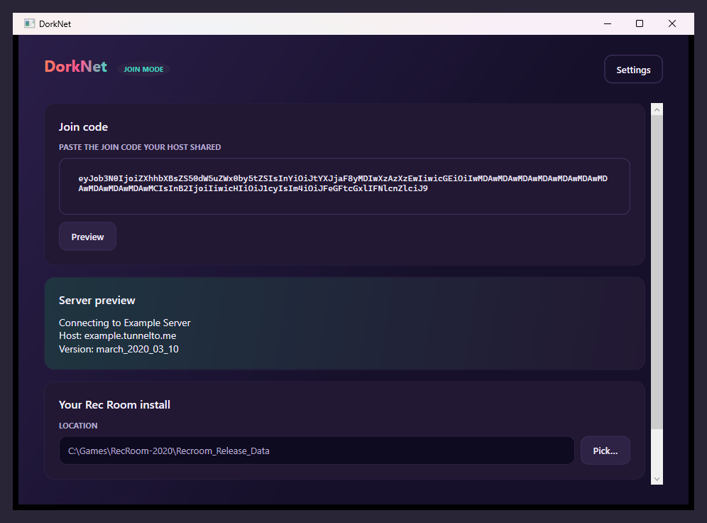

# Joining a friend's DorkNet server

> Built for players whose friend already runs a server and gave them a
> code. If you want to *host* instead, see [easy-setup.md](easy-setup.md).

A "join code" is a one-line string your host's launcher generated when
they hit Start hosting. It contains everything DorkNet needs to point
your Rec Room at their server: the public hostname, the Photon AppIds,
the version, and the server's display name. The launcher decodes it
locally — nothing is sent anywhere until you actually launch the game.

## What you'll need

- Windows 10 or 11
- A copy of **Rec Room 2020.03.10** — your own, see
  [Getting the 2020 client](easy-setup.md#getting-the-2020-client)
- The join code your friend gave you (a base64-looking blob a few hundred
  characters long)
- No accounts / installs needed for the default **Friends anywhere ·
  Localtunnel** join: the host's `*.loca.lt` URL is baked into the join
  code, you just paste it and play. The first time your machine hits a
  given `*.loca.lt` URL, your browser may show a one-time "Click to
  Continue" interstitial — open the URL once in any browser to clear it.
- About 2 minutes

You **don't** need a Photon account of your own. The join code carries
your friend's AppIds; the launcher rewrites them into your client.

## Download

Grab `dorknet.exe` from the
[latest release](https://github.com/DorkSquadRR/DorkNet/releases/latest).
Same single-file binary as the host's. Drop it anywhere; state lives in
`%APPDATA%\DorkNet`.

## First launch

Welcome screen → **GET STARTED** → setup wizard.

### Wizard step 1 — Pick "Use a code"

The right-hand card.

Join mode skips the host-only wizard steps (server name + Photon), so
your wizard runs 3 steps total instead of 5.

### Wizard step 2 — Find your Rec Room install

The launcher auto-detects common manual-install locations. If detection
worked you'll see a green "Detected install" banner; otherwise click
**Browse…** and point at your `Recroom_Release_Data` folder (the *_Data
sibling of `Recroom_Release.exe`).

### Wizard step 3 — Done

That's it for the wizard. Click **Finish** to land in the main view.

## The main view — Join

- **Sidebar** (left): same nav as the host's launcher — **Host a
  server**, **Join a friend**, **Settings**, **Re-run setup**. You're
  on **Join a friend**.
- **Header** (top): JOIN eyebrow, "Join a friend" title, and the
  **Screen mode** checkbox top-right.

### Paste the join code

Paste the code your friend sent you into the **PASTE THE CODE YOUR
HOST SHARED** textbox. Hit **Preview** — the launcher decodes the code
and pops a "Server preview" panel showing:

- the server's display name,
- the host address (Localtunnel `*.loca.lt`, LAN `sslip.io`, or a custom
  host),
- the version key (must match your install — the patcher will warn if
  not).

Sanity-check it. **Codes from strangers can point anywhere — only paste
codes from people you trust.** A malicious code wouldn't compromise
your machine, but it could send your Rec Room login traffic to someone
else's server.

### Confirm your Rec Room install

Same picker as on the wizard. The path shows in monospace below the
Rec Room install header. Click **Browse…** to change it if needed.

## Applying the patch

Click **APPLY PATCH** (the orange button below the install picker; it
stays disabled until you've pasted a valid code).

The launcher runs three steps:

1. **Download patcher** — fetches the version-specific patcher payload.
   ~10 MB, cached for next time.
2. **Strip Steam DRM** — only runs if your install is a Steam build.
3. **Apply patch** — rewrites network URLs and Photon AppIds in place.

Progress steps show inline. If anything fails, the row turns red and
you get **Retry** + **Get help** buttons.

The original `Recroom_Release.exe` and its DRM-stripped copy are
preserved as backups next to the modified files; the patcher is
reversible.

## Launching Rec Room

When the patch completes, the **LAUNCH REC ROOM** button (teal)
appears. Click it. The launcher starts your patched Rec Room with the
right command-line.

Tick **Screen mode** in the top-right of the header first if you want
to play in 2D desktop mode instead of VR.

You'll see the regular Rec Room login screen — log in with the account
your host gave you (each DorkNet server has its own player database),
and you're in their world.

---

## Switching to a different friend's server

You can re-patch any time. Paste the new code, hit **Preview** to
verify, click **APPLY PATCH** again. The patcher detects the existing
patch and updates the destination — no need to repair first.

If you want to go back to the official Rec Room servers, the patcher's
backups are still there: rename `Recroom_Release.exe.bak` (or
`.steamless.bak`) back to `Recroom_Release.exe`. Or just reinstall.

## Switching to host mode

Sidebar → **Host a server**. You'll need to fill in server name +
Photon AppIds before you can host. See
[easy-setup.md](easy-setup.md) for that workflow. The launcher
preserves your install path and screen-mode preference when you switch.

---

## My account doesn't exist on the server

Each DorkNet server runs its own player database. The first time you
join, you need an account on that server. Your friend can sign you up
through their admin panel, or you can use the in-game "Create account"
flow if signups are enabled.

If you've joined the same server before and switched away, your old
account is still on their database — log in with the same credentials
you used before.

## Voice chat doesn't work

Voice routes through Photon Voice, which is a separate AppId. If your
host hasn't set one up, voice chat won't work in-game. You can still
use Discord or any other voice tool alongside.

## "Photon CustomAuth 401" or game stuck on the loading screen

Almost always one of:

- Your host set up a new Photon AppId since your last join. Paste the
  new code, re-apply the patch.
- Your Photon **region** in the code doesn't match the server's. This
  is set by the host; ask them to confirm the region.
- The patch didn't actually apply — check the launcher's progress
  panel; a red row means the patcher errored.

## "Check your internet connection" / black screen

Almost always: the host restarted hosting since they sent you the join
code, so the Localtunnel URL it points at no longer exists. Ask the
host to copy the current join code from their launcher and re-share it.
Re-apply the patch with the new code.

If that doesn't fix it, open the host's `*.loca.lt` URL in your browser
once — Localtunnel sometimes shows a one-time "Click to Continue"
interstitial that needs to be cleared by hand before the patched client
can reach the server.

## More troubleshooting

[troubleshooting.md](troubleshooting.md) lists the rest.
